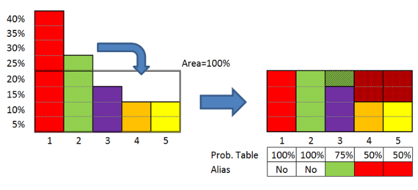

# Alias Method

This simple code demonstrates the alias method using R.
The Alias method is an efficient algroithm used for sampling from discrete probability distributions.
The algorithm uses tables to generate random outcomes.

Image Citation: https://www.researchgate.net/figure/Example-of-alias-method_fig10_326356402
